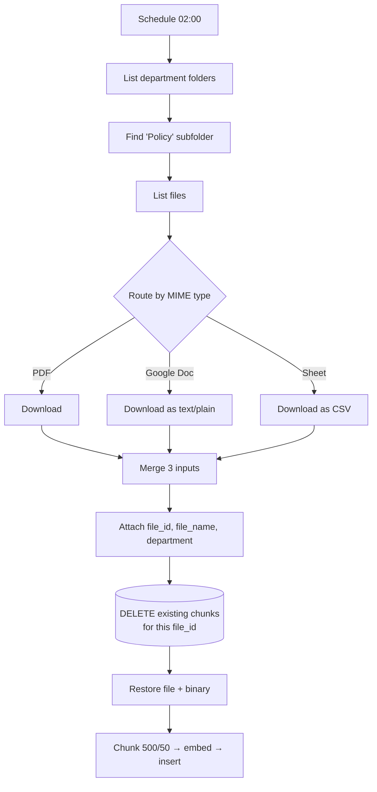
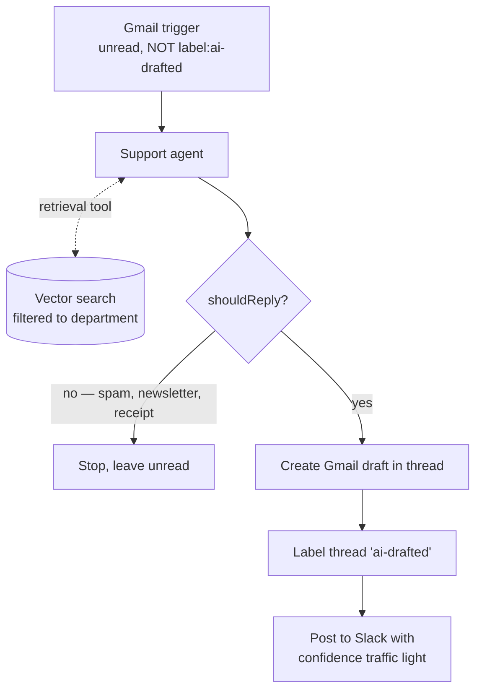

# Gadgets & More — policy-grounded support email drafting

Two n8n workflows for a retail electronics support desk. One keeps a vector knowledge
base in sync with the store's policy documents in Google Drive. The other watches the
support inbox, answers only from those documents, and leaves a **draft** for a human to
review and send.

27 nodes across both. Built in n8n with Claude Code.

## The problem it solves

Support inboxes are mostly the same twenty questions about returns, warranties and
shipping, and the answers are all written down already — in a Drive folder nobody opens
mid-conversation. The obvious automation is to point an LLM at the inbox, and the obvious
failure is that it answers "30 days" when the policy says 14, in a tone confident enough
that nobody checks.

Two constraints shape the whole build:

- **Every policy claim must come from a retrieved document.** No timeline, fee or
  eligibility rule may originate from the model.
- **Nothing reaches a customer unreviewed.** The Gmail node writes a *draft*, never a
  send. A human is always the last step.

## Architecture

Two workflows, joined by a Supabase vector table rather than by a direct call.

### 1. Policy KB Ingestion — nightly, 02:00

### 2. Support Email Auto-Drafter — polls every 15 min

## Design decisions worth explaining

**It drafts; it never sends.** The Gmail node is set to `resource: draft` with the
original `threadId`, so the reply lands in the right conversation waiting for a human.
This is the single decision the rest of the design is built around — it's what makes an
imperfect retrieval step acceptable rather than dangerous.

**The label is the loop guard.** The trigger polls for unread mail matching
`-label:ai-drafted`, and the step right after drafting applies exactly that label. Without
it, a polling trigger re-reads the same unread thread every 15 minutes and drafts against
it forever. The filter and the labelling step are one mechanism, and neither half works
alone.

**Triage is three-way, not binary.** A naive version asks "is this a support question?"
and replies to everything else anyway. Here the model sorts into support question,
genuinely misdirected human inquiry, or no-reply-needed — and the third case produces no
draft at all, so newsletters and shipping receipts don't generate work for a reviewer.
Only the first case is allowed to call the retrieval tool.

**"No match" is a designed output, not a failure.** When retrieval returns nothing that
truly covers the situation, the model is told to write a warm handoff that asks for the
specifics a human would need — order number, purchase date, model and serial, whether
it's still boxed — and explicitly never to mention tools, systems or databases. The
customer gets a useful reply either way; the reviewer sees the difference.

**Confidence is surfaced where the human is, not buried in the log.** Every draft posts
to Slack with 🟢 / 🟡 / 🔴 tied to how well the retrieved policy actually supported the
answer, and a deep link into the Gmail thread. Low confidence is the model's own signal
that it fell back — which is the case a reviewer most needs to look at, and would
otherwise be invisible.

**Retrieval is scoped by department metadata.** The vector search filters on
`department: technical_support`, and ingestion stamps that field from the Drive folder
name. One table can serve several departments' agents without one team's policies
answering another team's mail.

**Re-ingestion is idempotent.** A nightly rebuild that only inserts will happily store
five copies of the returns policy by Friday, and retrieval quality degrades as duplicates
crowd the results. Each file's existing chunks are deleted by `file_id` immediately before
its new ones are written, so a re-run replaces rather than accumulates.

**The Postgres step drops the file, so the file is put back.** That `DELETE` returns query
results, and its output replaces the item stream — including the downloaded binary the
loader still needs. The `Restore File Data` Code node re-reads `$('Attach Metadata').all()`
and hands the file and its metadata back downstream. The delete is also set to always
output data: a `DELETE` matching zero rows, which is every file on first ingest, otherwise
returns nothing and the branch stops before it ever inserts anything.

**The Merge node is set to three inputs explicitly.** PDFs, Docs and Sheets take separate
download paths because each needs a different conversion. n8n's Merge defaults to two
inputs, and the third connection is accepted silently and then ignored — meaning every
spreadsheet would vanish from the knowledge base with nothing in the log to say so.

**External calls retry with backoff.** Every Drive call gets 3 attempts 5s apart, the
Gmail and Supabase steps 2, and Slack waits 3s between tries. Both workflows are
unattended — nightly and polled — so a transient 5xx that isn't retried is a silent gap
in the knowledge base or a customer email that never gets drafted.

## Running it

Both exports have instance-specific identifiers replaced with `REPLACE_WITH_YOUR_*`
placeholders. To run them you need:

| What | Used for |
|---|---|
| n8n (self-hosted or cloud) | The runtime |
| Google Drive OAuth | Reading the policy documents |
| Gmail OAuth | Trigger, draft creation, labelling |
| Supabase + pgvector | Vector store for policy chunks |
| Postgres credential | The idempotent delete, against the same database |
| OpenAI API key | Embeddings, drafting, structured-output repair |
| Slack app | Review notifications |

Then:

1. In Supabase, create the `documents_gadgets_more` table and the
   `match_documents_gadgets_more` function (n8n's Supabase vector store docs include the
   SQL for both).
2. Import `workflows/policy-kb-ingestion.sanitized.json` and
   `workflows/support-email-auto-drafter.sanitized.json`.
3. Replace every `REPLACE_WITH_YOUR_*` placeholder — credentials, the Drive root folder
   ID, the support inbox address, and the Gmail label ID for `ai-drafted`.
4. Create the `ai-drafted` Gmail label, and set the Slack channel on the alert node.
5. Arrange Drive as `root / <Department> / Policy / <documents>`, run the ingestion
   workflow once manually, and confirm chunks land in the table before activating either.

## Stack

n8n · OpenAI (embeddings, drafting) · Supabase pgvector · Postgres · Gmail API · Google
Drive API · Slack · built with Claude Code
