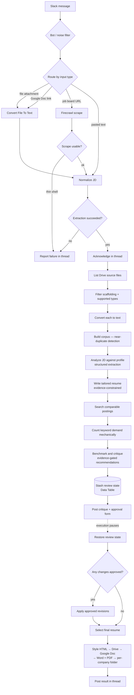

# Tune-Resume — job description in, tailored resume out

Drop a job posting into a Slack channel — a PDF, a Google Doc link, a job-board URL,
or just pasted text — and about ninety seconds later the thread comes back with a
critique of the draft it wrote, a checklist of proposed changes, and a request for
your approval. Approve what you want, and it publishes a formatted Word and PDF
resume into a per-company folder in Google Drive.

57 nodes. Built in n8n with Claude Code.

## The problem it solves

Tailoring a resume per application is the advice everyone gives and nobody follows,
because doing it honestly takes 45 minutes and doing it dishonestly takes five. The
dishonest version is what most AI resume tools automate: feed them a posting and they
hand back a document confidently claiming you have whatever the posting asked for.

The design constraint here is the opposite one. **Every claim on the output must trace
back to a fact in the candidate's own source material.** Reordering, reweighting and
rewording real experience is the entire product. Inventing a line of it is a defect.

That constraint is why this is more than a prompt.

## Architecture

## Design decisions worth explaining

**Four input routes converge on one node.** A file, a Drive link, a scraped URL and
pasted text all produce different shapes. `Normalize JD` collapses them with a single
coalescing expression rather than four parallel downstream branches. Adding a fifth
input type means adding one route, not duplicating a pipeline.

**The scraper is assumed to fail.** LinkedIn and Indeed block scrapers or wall them
behind a login, and what comes back is a cookie banner, not a job posting. A length
check catches the thin shell and reports it in-thread instead of tailoring a resume
against boilerplate.

**Anti-loop guard on the trigger.** The workflow posts into the same Slack channel it
listens to. Without a `bot_id` check on the very first filter, its own thread replies
re-trigger it, forever. This is the kind of thing you find in production, once.

**State survives the pause.** The Slack approval step suspends the execution, possibly
for hours. n8n does not restore pre-pause run data when a `sendAndWait` execution
resumes, so any `$('UpstreamNode')` reference across that boundary silently breaks.
Everything the second half needs is serialized into a Data Table row before the pause
and read back after it.

**Near-duplicate detection on the source corpus.** The Drive folder accumulates copies
of the same facts file — a Google Doc and a markdown export, differing in bullet
glyphs, line endings, and usually a few edits. Exact-match dedupe misses all of them.
Trigram Jaccard at 0.9 catches them and keeps the longer copy.

**Keyword demand is counted, not guessed.** Before the critique runs, the workflow
pulls comparable live postings and counts, mechanically, how many of them mention each
keyword. The reviewer is handed those counts as fact and told to cite them as given.
An LLM asked to estimate market demand will produce a confident number; this produces
a real one.

## The bug that shaped the design

The first version had a clean writer and a reviewer that graded its output against
market research. Run against a real posting, the writer behaved — it respected the
gap list and omitted what the source material didn't support.

The reviewer then put it all back.

It returned recommendations like *"Add the phrase 'Product Management and roadmap
ownership experience' to the summary — Product Management appears in 2/5 comparable
postings."* The candidate material never claimed product management anywhere, and the
upstream analysis had already flagged it as a gap. Six more recommendations in the
same shape followed, and each one landed in the final document verbatim.

Three things had to be true at once for that to happen:

1. **The no-fabrication rule was scoped to the wrong things.** It banned inventing a
   *skill, employer, title, date, metric or certification* — a list of nouns. The
   recommendations proposed *wording*, so nothing in the rule applied.
2. **The reviser had no way to check.** By design it never receives the corpus; its
   prompt says its only facts are the draft plus anything quoted inside the change
   details. So an asserted phrase in a recommendation was, structurally, a licensed
   fact. The critique was trusted as a source with nothing verifying it.
3. **The schema demanded at least four recommendations.** A floor on the output is a
   quota, and a model that has run out of honest suggestions will meet a quota with
   dishonest ones.

The fix is structural rather than another instruction:

- Every recommendation now requires a **`source_quote`** — verbatim text from the
  candidate material that already states the claim. A required field in the output
  schema is a shape the model has to fill; a rule in a prompt is a request it can
  drift from.
- The quote travels inside the recommendation detail, so the reviser — which still
  never sees the corpus — finally has real evidence rather than an assertion.
- The upstream gap list is passed into the reviewer as authoritative, with an explicit
  instruction never to recommend re-adding anything on it.
- The minimum went from four to zero, with the prompt stating that two well-evidenced
  recommendations, or none at all, is a correct outcome.
- The approval card in Slack now shows the supporting quote under each proposed change,
  so a weak one is visibly rejectable before it reaches the document.

The general lesson: **a guardrail written as a list of nouns will be walked around by
anything not on the list, and a downstream stage that cannot verify its input will
launder whatever the upstream stage asserts.** Putting the evidence requirement in the
schema rather than the prompt is what actually closed it.

## Running it

The published export has all instance-specific identifiers replaced with
`REPLACE_WITH_YOUR_*` placeholders. To run it you need:

| What | Used for |
|---|---|
| n8n (self-hosted or cloud) | The runtime. Data Tables must be available. |
| Slack app | Trigger channel, thread replies, and the approval form |
| Google Drive + Docs OAuth | Reading source material, writing Word/PDF output |
| OpenAI API key | Extraction, drafting, critique |
| Firecrawl API key | Scraping postings and comparable-role research |
| A `Convert File To Text` sub-workflow | PDF/DOCX/Doc → text |

Then:

1. Import `workflows/tune-resume.sanitized.json`.
2. Replace every `REPLACE_WITH_YOUR_*` placeholder — credentials, the Slack channel ID,
   the Drive source folder ID, the output folder ID, and the sub-workflow reference.
3. Put your career source material in the Drive source folder. Files named `README*`,
   `AGENT_INSTRUCTIONS*`, `STYLE_RULES*` or `SAMPLE_RESUME*` are deliberately excluded
   from the corpus — that filter exists so guidance-to-self doesn't get read as career
   fact and end up on the resume.
4. Activate, and drop a job posting in the channel.

## Stack

n8n · OpenAI (extraction, drafting, critique) · Firecrawl · Slack · Google Drive and
Docs APIs · n8n Data Tables · built with Claude Code
